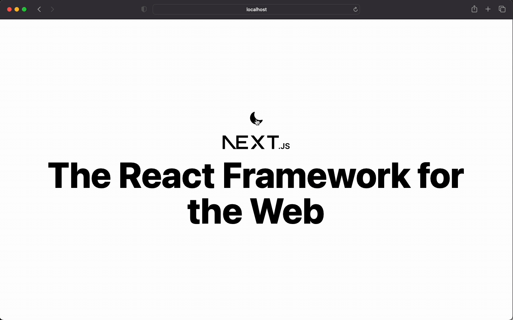

This is a [Next.js](https://nextjs.org/) project bootstrapped with [`create-next-app`](https://github.com/vercel/next.js/tree/canary/packages/create-next-app). Project demonstates how to implement a dark mode with tailwindcss and SSR.



## Added Dependences
* [tailwindcss](https://tailwindcss.com) for styling
* [heroicons](https://heroicons.com) for icons

## Getting Started

First, install dependences:

```bash
npm install
# or
yarn install
# or
pnpm install
```

And then run the development server

```bash
npm run dev
# or
yarn dev
# or
pnpm dev
```

Open [http://localhost:3000](http://localhost:3000) with your browser to see the result.
